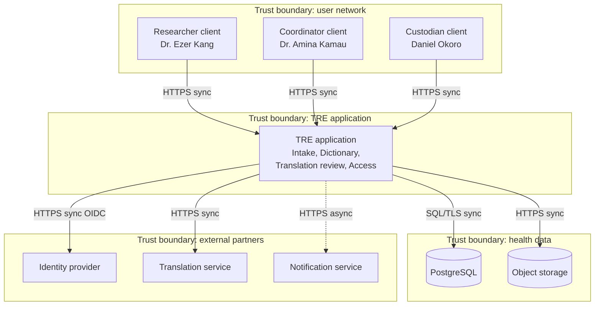
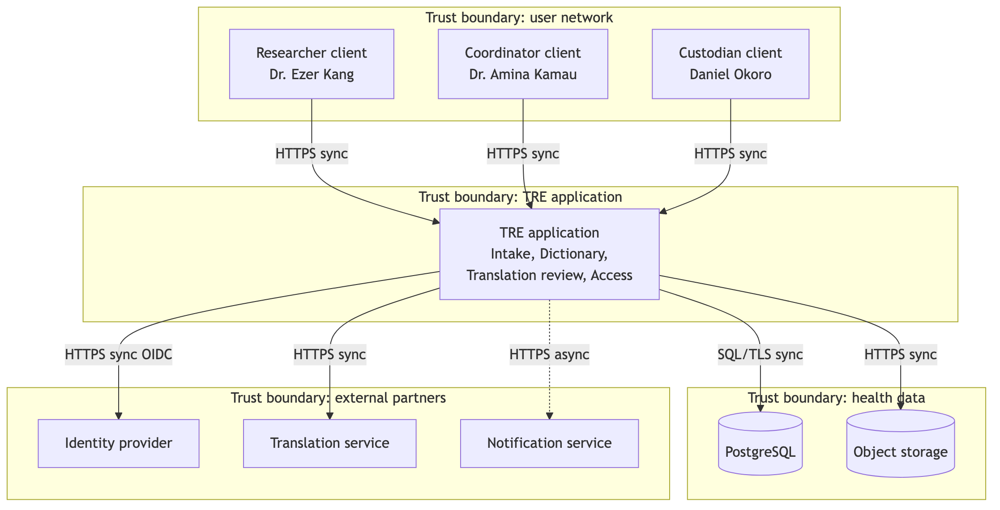

# B2. Architecture diagram

**Caption:** This architecture supports PP-1, PP-2, PP-3, PP-4, and PP-5. The TRE application is the modular monolith from B1. Arrows that cross a trust boundary are labeled with the protocol.

Legend, matching the lecture: a box is a client, a service, or an external system. A cylinder is a data store. A dashed box is a trust boundary. A solid arrow is synchronous. A dotted arrow is asynchronous. There is no message broker. B1 rejected an event-driven core. Notification is a direct async call.

The modules inside the application match the class clusters. Intake and Dictionary own Dataset, FieldDefinition, and LocalTerm. Translation review owns Translation. Access owns AccessRequest and AuditRecord. Identity provider and Notification service are the same external systems as on the context diagram and the class diagram.

Each arrow that leaves a dashed box is labeled. Authentication at the identity provider is the verify(session) call in the UC-6 sequence. The security story for these crossings is in B1 section 5.
