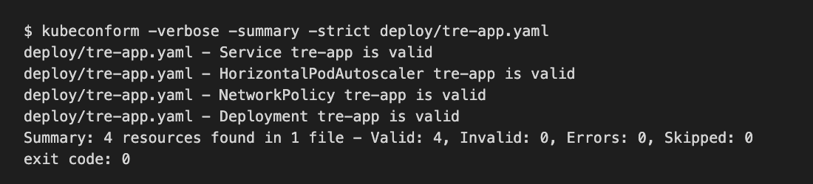

# C. Kubernetes manifest

**Caption:** This manifest supports PP-4 and the rest of the MVP by deploying the one TRE application from B2. The access module, the dictionary, and translation review run in that same application.

A Kubernetes manifest is a YAML file that states the desired setup: which image to run, how many copies, how much CPU and memory each copy gets, and how other programs reach it. Kubernetes keeps the cluster in line with that file. This project does not need application code or a container build. The manifest points at a made-up image, `tre-team/app:0.1.0`.

The files are `deploy/tre-app.yaml`. `kubeconform` checks them with no cluster.

## How it scales and how it is secured

The Deployment starts at 2 replicas, so one pod can restart while the other still answers. The HorizontalPodAutoscaler raises that count when average CPU stays above 70 percent, and it stops at 6 replicas. The Service type is ClusterIP, so only traffic from inside the cluster can reach the pods. The NetworkPolicy allows inbound traffic only to port 8080 and outbound traffic only to DNS, to PostgreSQL on 5432, and to HTTPS on 443 for the identity provider, object storage, translation, and notification. The database password and the translation API key are read from the Secret named `tre-db` and the Secret named `tre-api`. The manifest does not contain those values. `runAsNonRoot: true` keeps the process off the root user.

