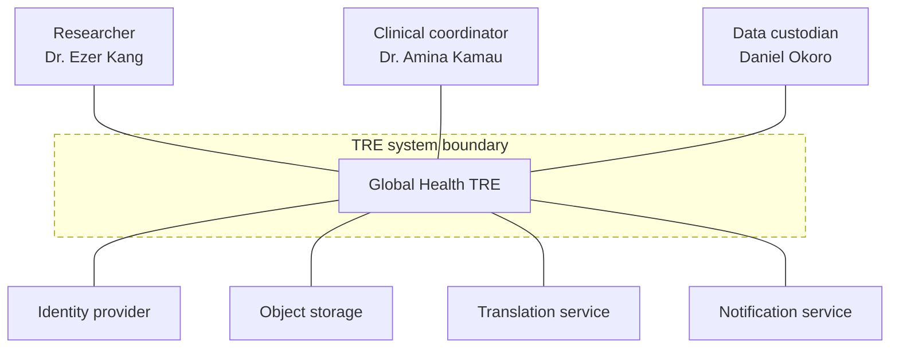
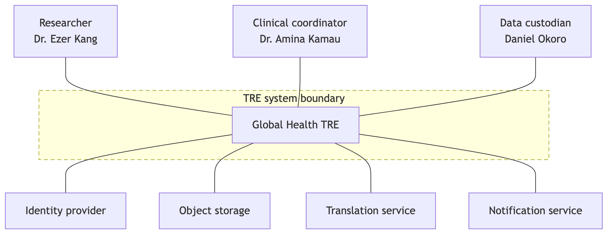

# A1. Context diagram

**Caption:** This context diagram supports PP-1, PP-2, PP-3, PP-4, and PP-5 by showing the TRE as one system between the three personas and the external services it uses.

## Boundary justification

The TRE builds the approval record: who asked for a dataset, why, and what Daniel Okoro decided. It also builds the dictionary, the local-term definitions, and the step where Dr. Kang accepts a translation. Sign-in and suggested translations are integrated. The identity provider owns accounts. The translation service owns the language model. The TRE only stores the text Dr. Kang has accepted.
