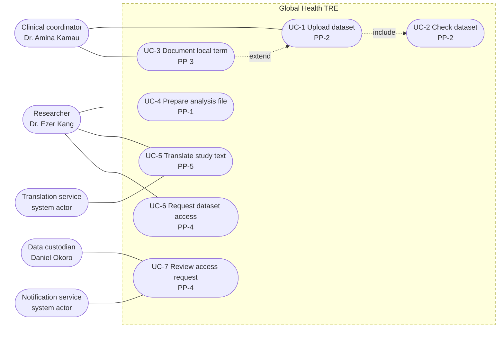
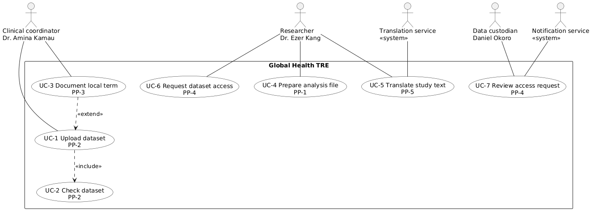

# A2. Use case diagram

**Caption:** This use case diagram supports PP-1, PP-2, PP-3, PP-4, and PP-5. Each use case is tagged with the pain point it addresses.

The exported figure is drawn from `A2-use-cases.puml` so the use cases sit inside the system boundary as ovals. The Mermaid block above is the same model: the same actors, the same seven use cases, the same include, and the same extend.

Human actors are the three personas. Translation service and Notification service are system actors. They also appear on the context diagram.

The **include** arrow points from UC-1 Upload dataset to UC-2 Check dataset. Every upload runs the check. The **extend** arrow points from UC-3 Document local term back to UC-1 Upload dataset. Documenting a term is extra behavior, used when the file contains a local term, and it is not required for every upload.
