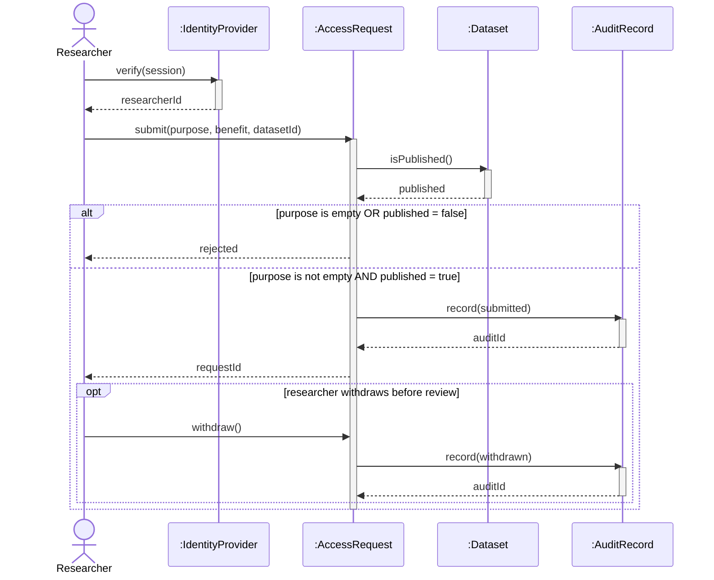
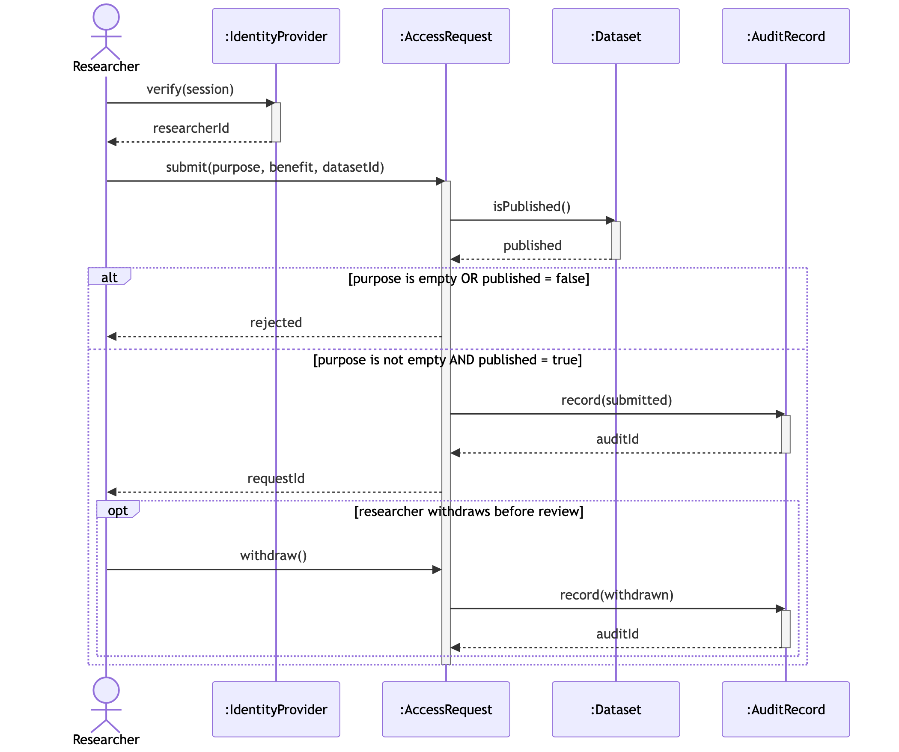
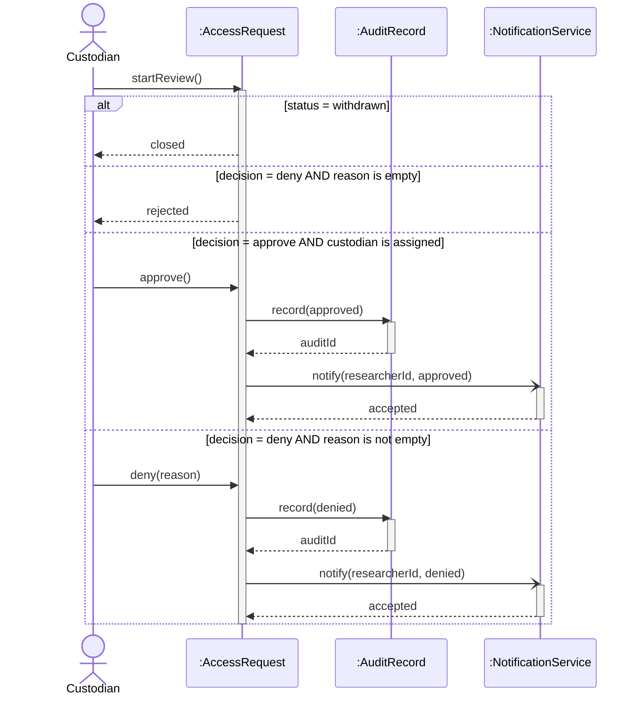
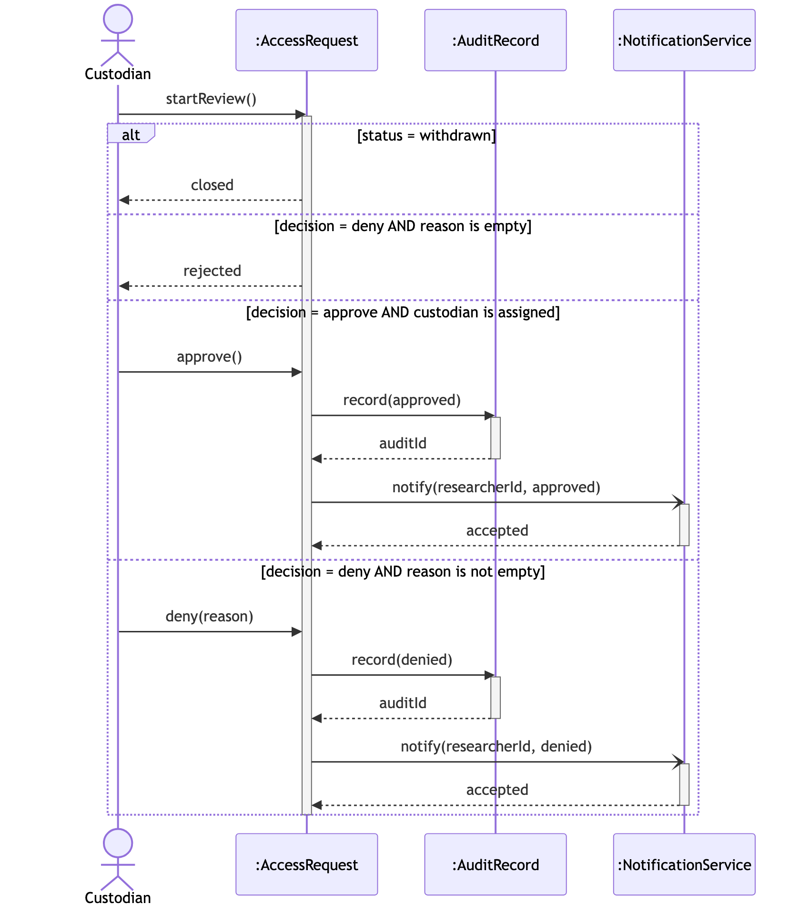

# A4. Sequence diagrams

Lifelines use the class names from A5. A solid arrow with a filled head is a synchronous call. An open arrowhead is asynchronous. A dashed arrow is a return. Guards are in brackets.

## UC-6 Request dataset access

**Caption:** This sequence supports PP-4 and matches the UC-6 steps, including the rejection and withdrawal paths.

Identity provider is the external system from the context diagram. The alt fragment is the failure path from UC-6. The opt fragment is the cancellation path.

## UC-7 Review access request

**Caption:** This sequence supports PP-4 and matches the UC-7 steps, including a withdrawn request and a denial with no reason.

Notification service is the external system from the context diagram. The notify messages use an open arrowhead because the TRE does not wait for the message to be delivered. The returns are dashed.
