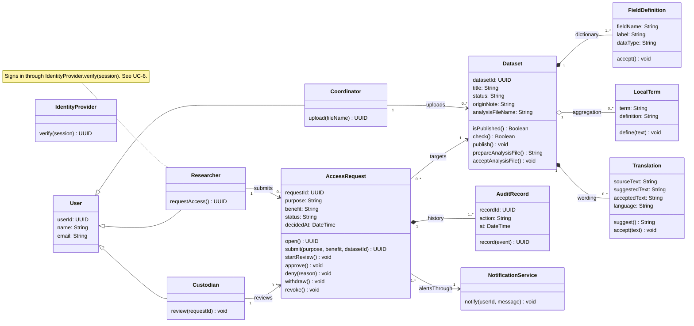
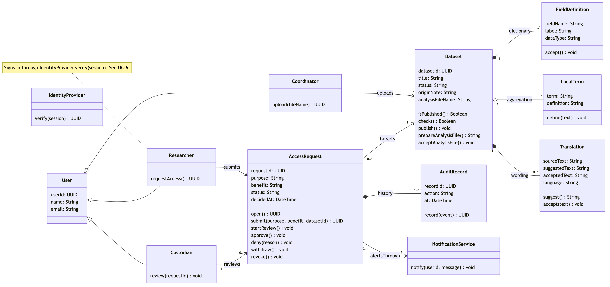

# A5. Domain class diagram

**Caption:** This class diagram supports PP-1, PP-2, PP-3, PP-4, and PP-5. Dataset carries the dictionary, local terms, and translations. AccessRequest carries the approval record.

Researcher, Coordinator, and Custodian are kinds of User. That is the generalization. A person has one role in this MVP, and only Custodian has review, approve, deny, and revoke.

FieldDefinition is a **composition** inside Dataset. A dictionary row names one column of that dataset and has no use if the dataset is deleted. AuditRecord is a composition inside AccessRequest for the same reason: the history belongs to that request. Translation is a composition because the accepted wording is part of that dataset's labels.

LocalTerm is an **aggregation**, drawn with a hollow diamond on Dataset. A hospital can reuse one term definition on a later dataset, so deleting one dataset does not delete the term. Researcher calls IdentityProvider.verify(session). That call is the note on Researcher and the first message in the UC-6 sequence.

IdentityProvider and NotificationService are the external systems from A1. They are on this diagram because the sequence diagrams call them.

Every message in A4 is an operation on the class that receives it:

| Sequence message | Operation |
|---|---|
| verify(session) | IdentityProvider.verify(session) |
| submit(purpose, benefit, datasetId) | AccessRequest.submit(purpose, benefit, datasetId) |
| isPublished() | Dataset.isPublished() |
| record(submitted), record(withdrawn), record(approved), record(denied) | AuditRecord.record(event) |
| withdraw() | AccessRequest.withdraw() |
| startReview() | AccessRequest.startReview() |
| approve() | AccessRequest.approve() |
| deny(reason) | AccessRequest.deny(reason) |
| notify(researcherId, approved) and notify(researcherId, denied) | NotificationService.notify(userId, message) |

UC-1 through UC-5 use the other operations: Coordinator.upload, Dataset.check, Dataset.publish, LocalTerm.define, Dataset.prepareAnalysisFile, Dataset.acceptAnalysisFile, and Translation.suggest plus Translation.accept. AccessRequest.open and AccessRequest.revoke are used by the activity diagram and the state machine.
