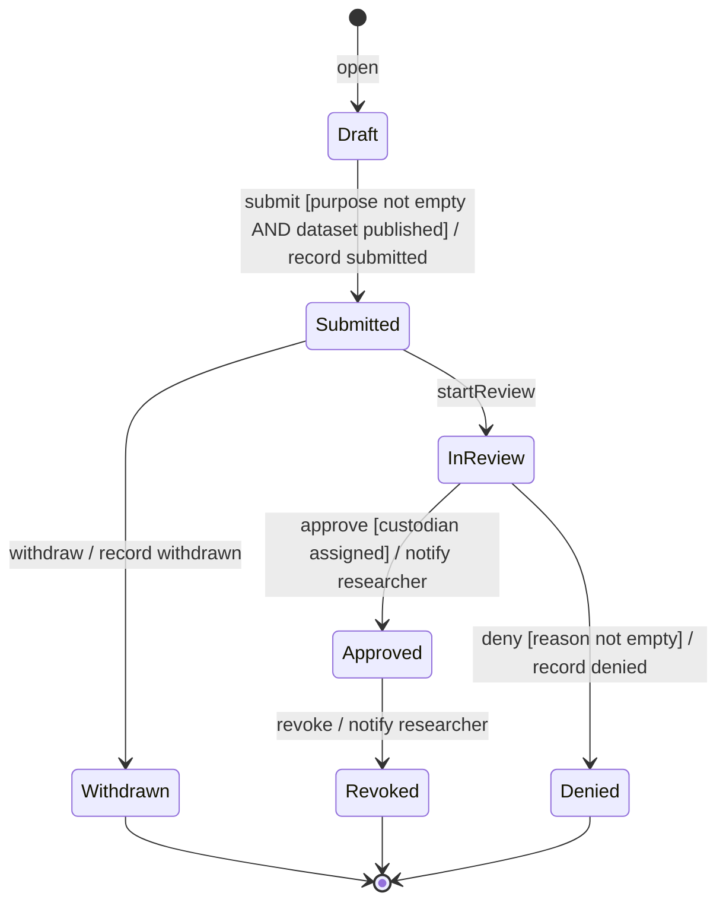
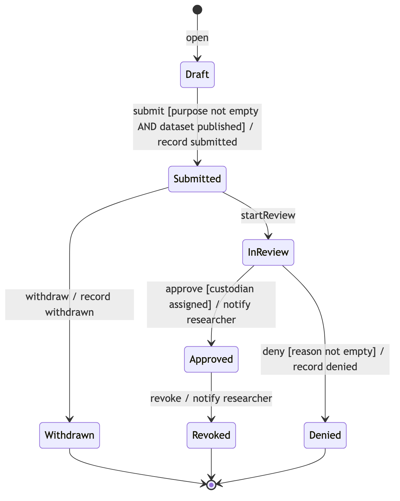

# A6. State machine diagram

**Caption:** This state machine supports PP-4. The entity is AccessRequest, the record Daniel Okoro uses to control who receives an analysis file.

There are seven states: Draft, Submitted, InReview, Approved, Denied, Withdrawn, and Revoked. Denied, Withdrawn, and Revoked each reach a final state.

The submit transition carries a guard and an action. Approval is refused when no custodian is assigned. Denial is refused when the reason is empty. Withdraw is the cancellation path. Deny is the failure path. Revoke is how the custodian takes back a file that was already released.

Each event also appears in a sequence diagram or in the activity diagram:

| Event | Where it appears |
|---|---|
| open | A7 activity, researcher lane |
| submit | A4 sequence UC-6, and A7 |
| withdraw | A4 sequence UC-6, opt fragment |
| startReview | A4 sequence UC-7, and A7 |
| approve | A4 sequence UC-7, and A7 |
| deny | A4 sequence UC-7, and A7 |
| revoke | A7 activity, custodian lane |
