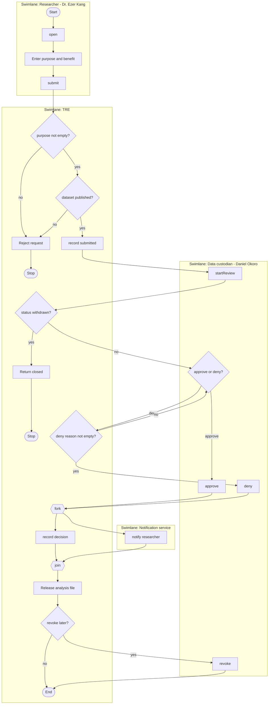

# A7. Activity diagram

**Caption:** This activity diagram supports PP-4, the pain point the walkthrough traces: a researcher asks for a published dataset, and the custodian decision is recorded before any analysis file is released.

The swimlanes are the researcher persona, the TRE, the custodian persona, and the notification service from the context diagram.

The decision diamonds are guarded. An empty purpose or an unpublished dataset stops the flow. A denial with an empty reason returns to the custodian. Approve and deny then fork. Recording the audit decision and notifying the researcher run in parallel, then join. The analysis file is released only after that join. Revoke is the later path from a released file back to the custodian, matching the Approved to Revoked transition.
